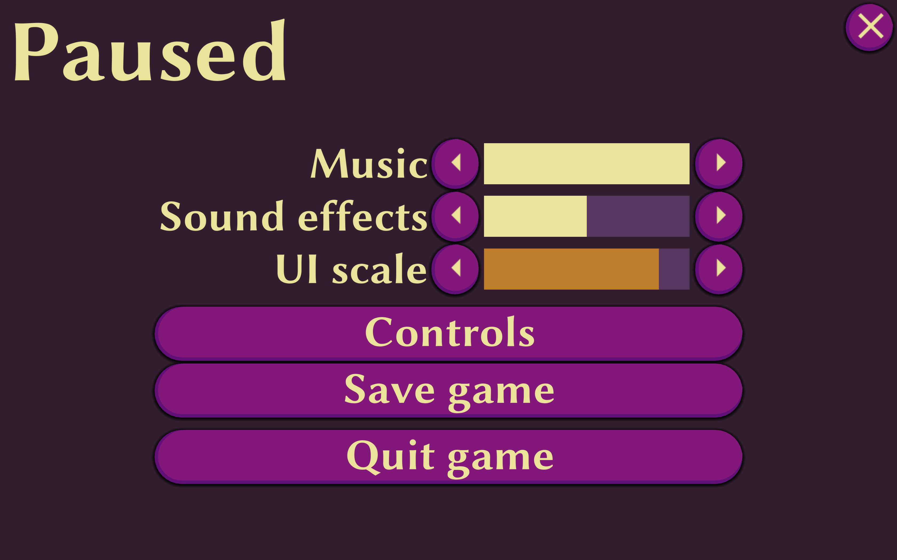

# Good UI Demo

For demonstrative purposes, this project was used as a positive example of a user interface (UI). This was made for the talk ***Why Your UI is Terrible and You Hate Working on it*** by **Lucky Adams** for the [Winnipeg Game Collective](https://www.pegjam.com/)'s August 2025 Slow Jam.

Made in Godot `4.4.1`.

## Stucture
The files are organized into folders based on their file type. Godot's [Control](https://docs.godotengine.org/en/stable/classes/class_control.html) nodes and [Themes](https://docs.godotengine.org/en/stable/classes/class_theme.html) are used to make

## Checklist
A checklist for making good UI.

- [ ] Keyboard & controller navigation using focus.
- [ ] Dynamic adjustment of layout based on window size.
- [ ] A setting to adjust UI scale.
- [ ] Cursor changing on button hover.
- [ ] Colour brightness contrasts. Check in grayscale.
- [ ] Appearance, UI style/themes.
- [ ] Button icons.
- [ ] Sound effects.
- [ ] Bonus: Animations.
